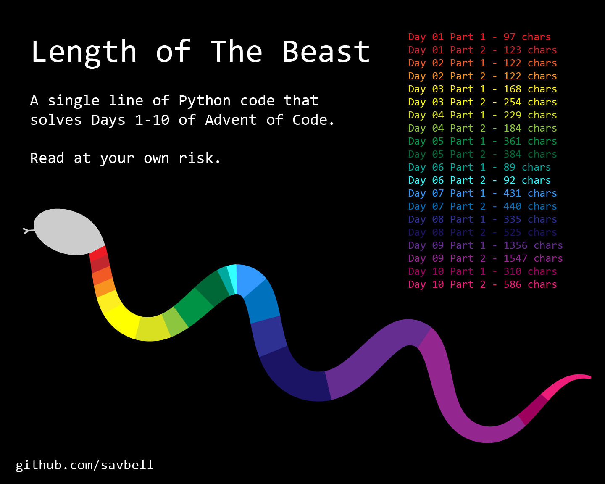

# 🐍📅 Advent of Code One-Line Solutions
As a personal challenge, I'm trying to solve every [Advent of Code](https://adventofcode.com/) problem in a single line of Python code. No, my solutions are not optimal. Nor readable. Nor useful in any other way. But it's fun, so here we go!

I originally attempted this in 2022 and made it through about a dozen days. I'm now working on 2023 in real time! You can follow along on this repository or through [my Reddit posts](https://www.reddit.com/u/ImpossibleSav).

Note that per copyright and [Eric Wastl's request](https://www.reddit.com/r/adventofcode/wiki/faqs/copyright/inputs/), input files are not included in this repository, so you must replace the file paths if you would like to run this code.

## Progress Tracking
| Status | Description |
| ------ | ----------- |
| ❌     | Problem not attempted yet |
| ✍     | Working on original solution |
| ⭐     | Original (OG) solution finished, working on one-line solution |
| ✅     | Completed both OG and one-line solutions |

### 2023 Solutions
| Day | Part 1 | Part 2 | Commentary |
|-----|--------|--------|------------|
| [01](2023/day-01.py) | ✅ | ✅ | This year, I'm removing my "no imports" restriction 😅 |
| [02](2023/day-02.py) | ✅ | ✅ | Getting in a lot of RegEx practice this year! |
| [03](2023/day-03.py) | ✅ | ✅ | Oh boy, the amount of RegEx I'm using is slowing down my computer... and [the Walrus](https://docs.python.org/3/whatsnew/3.8.html#assignment-expressions) is back! |
| [04](2023/day-04.py) | ✅ | ✅ | Pulling out some [dunder (magic) methods](https://docs.python.org/3/reference/datamodel.html#special-method-names) for this one! |
| [05](2023/day-05.py) | ✅ | ❌ | `lambda`s are making their first appearance... |
| [The Basilisk](2023/the-basilisk.py) ||| A single line of code that combines all of the above days' solutions into one! |

### 2022 Solutions
Currently I am not working on 2022 problems, but this is where I left off:

| Day | Part 1 | Part 2 | Commentary |
|-----|--------|--------|------------|
| [01](2022/day-01.py)  | ✅     | ✅     |  |
| [02](2022/day-02.py)  | ✅     | ✅     |  |
| [03](2022/day-03.py)  | ✅     | ✅     |  |
| [04](2022/day-04.py)  | ✅     | ✅     |  |
| [05](2022/day-05.py)  | ✅     | ✅     | This one is a bit cheese but I'm doing my best. Requires Python 3.8 (https://peps.python.org/pep-0572/). |
| [06](2022/day-06.py)  | ✅     | ✅     |  |
| [07](2022/day-07.py)  | ✅     | ✅     | Even more cheese. But we got it! |
| [08](2022/day-08.py)  | ✅     | ✅     | Oh boy, I've started cheesing in my OG solutions now too. |
| [09](2022/day-09.py)  | ✅     | ✅     | Today's solution is brought to you by `x.insert(0, x.pop(0)+1)`. |
| [10](2022/day-10.py)  | ✅     | ✅     |  |
| [11](2022/day-11.py)  | ✅     | ✅     |  |
| [12](2022/day-12.py)  | ⭐     | ⭐     |  |
| [13](2022/day-13.py)  | ✍     | ❌     |  |
| [14](2022/day-14.py)  | ✅     | ✅     |  |
| [The Beast](2022/the-beast.py) ||| A single line of code that combines all of the above days' solutions into one! |

## Repo Organization
Within each year's folder:
- All the one-line solutions are combined into a single disgusting line of code that solves all the Advent of Code problems at once, nicknamed based on the year:
  - **2023:** [`the-basilisk`](2023/the-basilisk.py)
  - **2022:** [`the-beast`](2022/the-beast.py)
- The `day-xx.py` files have my first solution attempts and the resulting one-liners. See them to better understand what the blasphemous code does.

## Fun Stuff
### Brief Strategy Explanations
Here are some fun ways I've been able to convert Python statements that normally require their own line into one-line expressions:
- **List comprehensions:** This entire thing wouldn't be possible without Python's [list comprehensions](https://docs.python.org/3/tutorial/datastructures.html#list-comprehensions), which allows you to have `for` and `if` statements within a single expression/line.
- **Short-circuit (lazy) evaluation:** Python has [short-circuit evaluation for its Boolean operations](https://docs.python.org/3/library/stdtypes.html#boolean-operations-and-or-not), which means the second expression in a Boolean operation is only evaluated if the result of the first expression does not guarantee the final result of the expression. This allows me to strategically use `and` and `or` to determine the order that expressions are executed, skipping around when necessary.
- **In-line assignment operator:** The [Walrus operator (`:=`)](https://docs.python.org/3/whatsnew/3.8.html#assignment-expressions) allows you to create and assign variables within an expression. I discovered it trying to parse [Day 5 in 2022](2022/day-05.py), and it has since been a hard carry.
- **Updating a list element in-line:** Since the assignment operator cannot be used with subscripts, it cannot be used to update lists (e.g. `a[0] := 1` is invalid). My solution for [Day 9 in 2022](2022/day-09.py) was to pop the element, modify it, and then insert it back into the same position. For example: `x.insert(0, x.pop(0)+1)`. Then, for [Day 4 in 2023](2023/day-04.py), I discovered the [`__setitem__()`](https://docs.python.org/3/reference/datamodel.html#object.__setitem__) method, which allows you to update a list element in-line. For example: `x.__setitem__(0, x[0]+1)`.
- **In-line import statements:** After not using import statements in 2022 since it would technically make my solutions more than one line, I discovered the built-in [`__import__()`](https://docs.python.org/3/library/functions.html#import__) function in 2023 that has finally allowed me to use [RegEx](images/2023-day-03-regex-meme.png) in my solutions.
- **My `while` loop within a list comprehension:** I was very proud of discovering this while working on [2022's Day 8](2022/day-08.py). Since I wanted my list comprehension to end execution once a condition was met, I had a tracker variable turn `True` when it was and included it in the `for` condition. But to do this in a single line, I needed to add another `if` condition that simply creates and assigns the tracker variable `False`, making sure it ran before the main list comprehension was calculated. An example line with a tracker variable called `found`: `[(x < t[r][c]) or (found:=True) for x in t[r][:c][::-1] if not found] if not (found:=False) else ''`

### Images
I created a visualization to show how many characters in 2022's The Beast are used to solve each day/part as of Day 10!

Other memes can be found in the [images](https://github.com/savbell/advent-of-code-one-liners/blob/master/images/) folder.

## Concluding Notes
Potential employers: I promise my production code is much, much better than this. Please don't blacklist me :(

... but if you're looking to reduce the lines of code in your codebase, I've got some ideas! ;)
